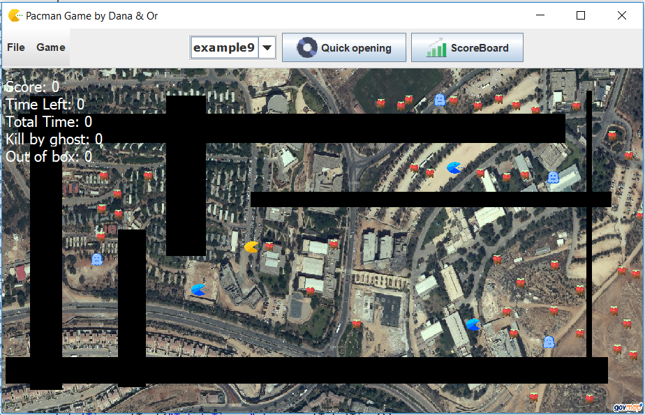
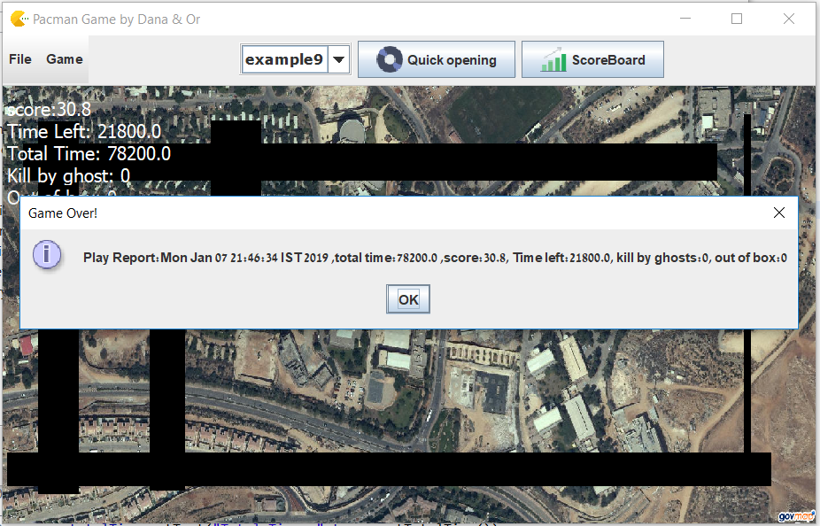
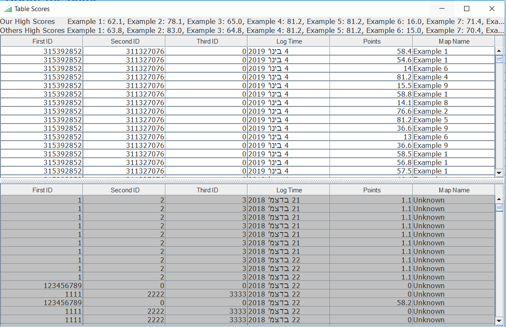

PACMAN
=========
This project represent a game of pacmans in Ariel University area.

Written by: Or Avital And Dana Morhaim

General info
--------
This projace is based on GPS project, wich can be found at 
<a href="https://github.com/oravital7/Ex2">https://github.com/oravital7/Ex2</a>,

and PacmanPlay project, wich can be found at 
<a href="https://github.com/DanaSMor/PacmanPlay">https://github.com/DanaSMor/PacmanPlay/Ex2</a>.

About the game
--------
The game is based on an old time pacman game.
It's based on client-server model.
The player inserts the location of the pacman, and the server calculates the locations of all the other components 
on the board by it's own algorithm, and sends back the information to the client.

How to play
--------
The player import a CSV file, insert the location of the Pacman and then choose how he wants to play. 

There are three options:
### Normal
The user is in charge of the direction of the pacman. 
The user clicks on a point and the pacman start moving towords the direction of the click.
### Step by step
The user is in charge of the direction of the pacman. 
The user clicks on a point and the pacman moves one step towords the direction of the click.
### Automatic
The automatic algo calculates the route of the pacman, and the game is played automatic.
The player can choose weather to insert the pacman, or let the algorithm choose the start point of the pacman.

The Game after choosing a map:

The Game when the game is over:

Awesome features
--------------
The user can watch the table of his own scores vs. the scores of the rest of the users.

General info
--------------
Read more in Wiki:
- Graphs: https://en.wikipedia.org/wiki/Graph_(discrete_mathematics)
- Dijkstra's Algorithm: https://en.wikipedia.org/wiki/Dijkstra%27s_algorithm

