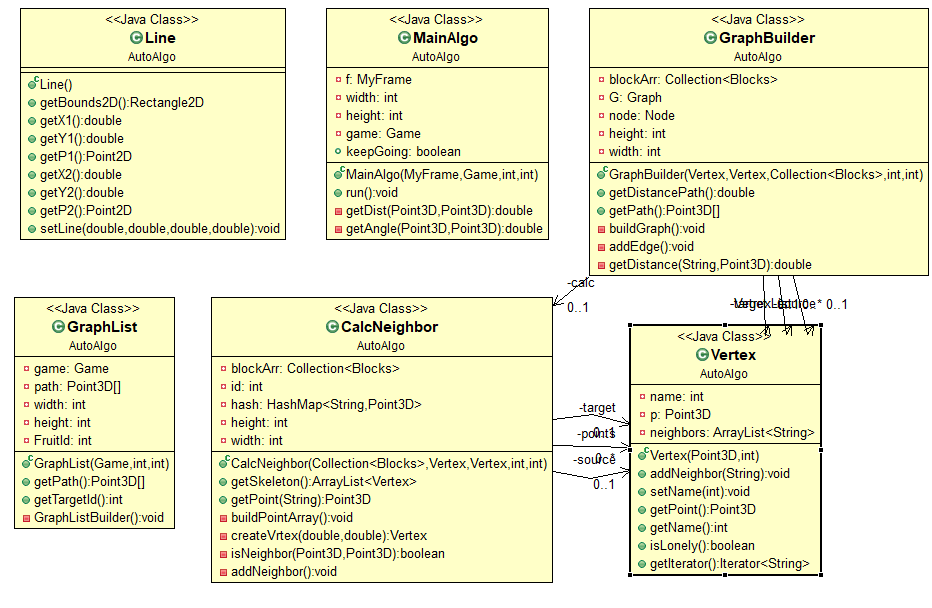

PACMAN
=========
This project represent a game of pacmans in Ariel University area.

Written by: Or Avital And Dana Morhaim

General info
--------
This projace is based on GPS project, wich can be found at 
<a href="https://github.com/oravital7/Ex2">https://github.com/oravital7/Ex2</a>,

and PacmanPlay project, wich can be found at 
<a href="https://github.com/DanaSMor/PacmanPlay">https://github.com/DanaSMor/PacmanPlay/Ex2</a>.

About the game
--------
The game is based on an old time pacman game.
It's based on client-server model.
The player inserts the location of the pacman, and the server calculates the locations of all the other components 
on the board by it's own algorithm, and sends back the information to the client.

How to play
--------
The player import a CSV file, insert the location of the Pacman and then choose how he wants to play. 

There are three options:
### normal
The user is in charge of the direction of the pacman. 
The user clicks on a point and the pacman start moving towords the direction of the click.
### Step by step
The user is in charge of the direction of the pacman. 
The user clicks on a point and the pacman moves one step towords the direction of the click.
### Automatic
The automatic algo calculates the route of the pacman, and the game is played automatic

Authomatic Algorithm - How does it work
--------
The algorithm for authomatic play is based on Dijkstra's Algorithm.
The algorithm calculates the shortest path from the pacman to each fruit on the board, and choose the closest fruit.

If the fruit got eaten while the pacman was trying to reach it, the algorithm calculates another route the the current closest fruit.

The algorithm is based on several classes:

##### Line Class
This class repreasent a line. 

##### Vertex Class
This class repreasent a vertex.
Each vertex has a name, point, and list of all his neighbors.

##### CalcNeighbor Class
This class calculates the neighbors of each vertex.
For each vertex the algoritm checks if he can see other vertexes.
if there is a straight line betwween them, it adds the vertex to the list of neighbors of the vertex.

##### GraphBuilder
This class builds a graph for a given source and desination,
using the CalcNeighbor class.

##### Graphlist
This class calculates the shortest path from given graphs.

##### MainAlgo
This class implements thread.
It calculates the shortest path from the pacman to each fruit on the board, and choose the closest fruit.
If the fruit got eaten while the pacman was trying to reach it, the algorithm calculates another route the the current closest fruit.

Class Diagram
--------

&nbsp;
&nbsp;

General info
--------------
Read more in Wiki:
- Graphs: https://en.wikipedia.org/wiki/Graph_(discrete_mathematics)
- Dijkstra's Algorithm: https://en.wikipedia.org/wiki/Dijkstra%27s_algorithm

